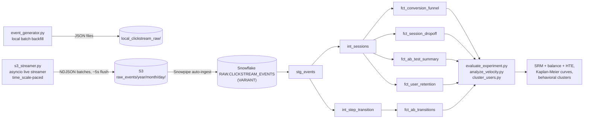

# Clickstream A/B Testing Pipeline

A synthetic e-commerce clickstream pipeline that simulates a checkout-redesign A/B test end to end: a near-real-time event generator streams multi-session user behavior into a cloud warehouse, dbt transforms it into analysis-ready marts, and a Python evaluation layer tests the experiment with proper statistical rigor.

The core question the project is built to answer: **did a new checkout UI improve purchase conversion, and can we trust that result?**

> **Result: no significant lift.** On a properly-powered run (317,418 users), `new_checkout_ui` shows coef = 0.114, p = 0.176 — not significant at α = 0.05, and no significant effect on conversion *speed* either. Randomization checked out clean (SRM and covariate balance both pass). Full breakdown in [Results](#results).

## Business questions this answers

- Did the new checkout UI actually increase purchase conversion, and is that result statistically trustworthy — not an artifact of bad randomization, pseudo-replication, or an underpowered sample?
- Does the redesign change the *speed* of conversion (time to move through checkout), even if it doesn't change *whether* someone converts?
- Where in the funnel do users actually drop off, and does that differ by device, acquisition channel, or new-vs-returning status?
- Are there behavioral segments — hesitant cart-abandoners, price-comparison browsers, loyal-but-never-converting users — that need a different intervention than a blanket UI change?
- Which acquisition channels and devices retain users best over time (cohort retention), independent of the experiment?
- Is the redesign winning or losing for any specific subgroup even though the overall effect is null?

## Architecture



Raw events never get parsed by file path — every downstream timestamp/attribute comes from the JSON payload itself (`raw_payload:...`), so batching multiple events per file needed no changes to the dbt layer at all.

## What this project does

1. **Simulates traffic in near-real time.** A Markov-chain funnel generator (`view_homepage → search_product → view_product_details → add_to_cart → checkout_initiated → purchase_completed`) produces synthetic clickstream events for a `control` vs. `new_checkout_ui` experiment. Users are persistent across 1–5 sessions with stable attributes, and `s3_streamer.py` runs as a live `asyncio` producer — new users arrive gradually across a signup window and each event uploads only once its own (time-compressed) real-time moment arrives, rather than being pre-computed and dumped as one instantaneous batch.
2. **Streams to the cloud efficiently.** Events are batched into periodic NDJSON files (one S3 object per ~5-second flush window, not one per event) and land under `raw_events/year=/month=/day=/`, picked up by Snowpipe auto-ingest into a Snowflake raw landing table.
3. **Transforms with dbt.** A layered dbt project (staging → intermediate → marts) turns raw JSON payloads into session-level facts, step-by-step transition timings, conversion funnels, drop-off analysis, retention cohorts, and A/B summary tables — backed by 88+ dbt data tests.
4. **Evaluates the experiment rigorously.** Python scripts run sample-ratio-mismatch checks, covariate balance checks, a cluster-robust heterogeneous-treatment-effect regression, per-funnel-stage Kaplan-Meier survival analysis, and KMeans behavioral segmentation on top of the dbt marts.
5. **Orchestrates the whole thing.** An Airflow DAG chains generation → dbt build → evaluation into a single pipeline (see the note in Key Decisions on why this isn't run on a recurring schedule as-is).

## File structure

```
config/
  config.yaml                    Funnel steps, transition probabilities, experiment config
src/
  generator/event_generator.py     Markov-chain event simulator + power-analysis-sized, checkout-reach-inflated cohort generation
  pipeline/s3_streamer.py          asyncio live streamer: time-scaled pacing, staggered arrivals, NDJSON batch uploads
  utils/sample_size.py             Power-analysis sample size calculator (two-proportion z-test)
snowflake/
  clickstream_setup.sql            DDL: database/schema, landing table, JSON file format, S3 stage, Snowpipe
dbt_clickstream/
  packages.yml                     dbt package dependencies (dbt_utils)
  models/staging/                  stg_events — parses raw VARIANT JSON from Snowflake
  models/intermediate/             int_sessions (session-level rollup), int_step_transition (per-step timestamps + transition seconds)
  models/marts/                    fct_conversion_funnel, fct_session_dropoff, fct_ab_test_summary,
                                    fct_user_retention, fct_ab_transitions
tests/                             dbt data-quality SQL tests + pytest unit/integration/e2e tests
pytest.ini                         Registers the `system`/`integration` pytest markers
scripts/
  evaluate_experiment.py           SRM check, covariate balance, cluster-robust HTE (logistic regression)
  analyze_velocity.py              Kaplan-Meier survival analysis — whole-session and per-funnel-step-transition
  cluster_users.py                 KMeans behavioral segmentation of users
verify_s3_events.py                Mark-recapture estimate of unique users currently landed in S3
orchestration/dags/clickstream_dag.py   Airflow DAG: stream → dbt build → evaluate
clear_s3.py / clear_snowflake.py        Utility scripts to reset the raw S3 prefix / Snowflake table
.github/workflows/ci.yml           CI: pytest suite + dbt parse on every push/PR
```

## How to run

**1. Install dependencies**
```bash
python -m venv .venv
source .venv/bin/activate        # or .venv\Scripts\activate on Windows
pip install -r requirements.txt
```

**2. Configure credentials**
Fill in `.env` (see `.env.example`) with your AWS and Snowflake credentials:
`AWS_ACCESS_KEY_ID`, `AWS_SECRET_ACCESS_KEY`, `AWS_REGION`, `S3_BUCKET_NAME`,
`SNOWFLAKE_USER`, `SNOWFLAKE_PASSWORD`, `SNOWFLAKE_ACCOUNT`, `SNOWFLAKE_WAREHOUSE`, `SNOWFLAKE_DATABASE`, `SNOWFLAKE_SCHEMA`.

**3. Set up Snowflake**
Run `snowflake/clickstream_setup.sql` in a Snowsight worksheet — creates the database/schema, the `CLICKSTREAM_EVENTS` landing table, the JSON file format (`STRIP_OUTER_ARRAY = FALSE` — matters, see Key Decisions), the S3 stage, and the auto-ingest Snowpipe. After `CREATE PIPE`, `SHOW PIPES` gives you a `notification_channel` (SQS ARN) that needs to be added as an event notification on the S3 bucket for auto-ingest to actually fire.

**4. Tune the experiment**
Edit `config/config.yaml` to set funnel transition probabilities and the control/variant checkout conversion rates you want to simulate.

**5. Generate and stream event data**
```bash
python -m src.generator.event_generator                          # local JSON backfill to local_clickstream_raw/
python -m src.pipeline.s3_streamer --time-scale 3600              # live-paced stream to S3 (default: 1 simulated hour per real second)
python -m src.pipeline.s3_streamer --num-users 100 --time-scale 36000   # cheap smoke test before a full run
```
The population isn't arbitrary — it's derived from a power analysis (`src/utils/sample_size.py`) against the control/variant rates in `config.yaml`, then **inflated** by the expected checkout-reach probability (computed from the funnel's own transition probabilities), since the configured lift only applies to the subset of sessions that reach checkout, not every simulated user.

**6. Verify ingestion (optional)**
```bash
python verify_s3_events.py   # mark-recapture estimate of unique users currently in S3 vs. the required N
```

**7. Run the dbt transformations**
```bash
cd dbt_clickstream
dbt deps    # installs dbt_utils (declared in packages.yml)
dbt build   # requires a `clickstream_dbt` profile in ~/.dbt/profiles.yml
```

**8. Evaluate the experiment**
```bash
python -m scripts.evaluate_experiment   # SRM, covariate balance, cluster-robust HTE
python -m scripts.analyze_velocity      # Kaplan-Meier: time-to-purchase and per-step-transition
python -m scripts.cluster_users         # behavioral user segmentation
```

**9. Run tests**
```bash
pytest tests/ -m "not system and not integration"   # fast unit tests only
pytest tests/                                         # full suite, needs live dbt+Snowflake / S3 access
```

**10. (Optional) Orchestrate end to end**
Deploy `orchestration/dags/clickstream_dag.py` to an Airflow instance.

## Key decisions

- **Denormalized fact tables, not a star or snowflake schema.** No `dim_*` tables exist — `device`, `variant`, `acquisition_channel`, `user_type` are plain columns on every fact table. These attributes are low-cardinality, don't change over time per entity, and have no hierarchy worth normalizing, so a proper dimensional model would add join complexity with no real benefit here.
- **NDJSON batching, not one-file-per-event or JSON-array batching.** The Snowflake file format is `STRIP_OUTER_ARRAY = FALSE`, so a JSON *array* per file would land as one row containing the whole array, not one row per event. Newline-delimited JSON (separate objects, one per line) is what Snowflake's native parser splits into rows automatically — no stage/pipe changes needed, while cutting per-file Snowpipe overhead by roughly two orders of magnitude versus one file per event.
- **`asyncio`, not threads, for the live streamer.** Pacing hundreds of thousands of concurrently-"waiting" simulated users with real OS-thread sleeps doesn't scale — coroutines are cheap enough to hold that many pending; a small thread pool handles just the blocking S3 upload calls.
- **Cluster-robust standard errors and user-level randomization checks.** Sessions from the same user share device/variant/channel and aren't independent observations. Testing SRM/balance/significance at the session level pseudo-replicates every user and produces spuriously significant results — everything runs at the user level or with SEs clustered by `user_id`.
- **`GROUPING SETS` for `fct_ab_transitions`**, not a UNION of two queries or duplicated aggregation logic — one query produces both the segment-level and variant-level rollups.
- **Population inflation derived from `config.yaml`, not hardcoded.** The expected checkout-reach probability is computed by multiplying the funnel's own transition probabilities (`expected_checkout_reach_prob()`), so the population size stays correct if the funnel is ever retuned.
- **The Airflow DAG isn't run on a recurring schedule.** `event_generator.py` simulates a *fixed, one-shot* statistically-sized cohort for a single experiment, not a continuously-arriving stream of new daily traffic, and the dbt marts are full-refresh tables. A cron-scheduled DAG would just re-run the same one-shot logic repeatedly rather than doing a genuine incremental job — the DAG is included as a demonstration of how you'd wire this into a scheduler, not a recommendation to actually run it nightly as currently designed.

## Key learnings

- **dbt tests caught real bugs, not just schema hygiene.** Across this build they surfaced: a source pointed at the wrong raw table name, a `unique` test that caught 3 real `session_id` collisions from an under-length UUID truncation (`str(uuid.uuid4())[:8]`, ~4.3B possible values — enough to collide at hundreds of thousands of sessions), and a suspicious `total_sessions == unique_users` pattern that led to finding `fct_conversion_funnel` was grouped at too fine a grain (day-level, on top of every other dimension) to ever show real repeat-visit signal.
- **The sample-size fiasco.** `calculate_sample_size()` computed the population size as if every simulated unit were a checkout attempt, but the configured lift is only applied at `checkout_initiated → purchase_completed`, and only ~9.6% of sessions ever reach that stage. The first full run landed the checkout-reaching subset at roughly a *fifth* of the required N — a technically correct power analysis, sized against the wrong population. The fix: derive the expected checkout-reach probability from the funnel's own transition probabilities and inflate the simulated population by its inverse, so the subset that's actually "at risk" for the effect hits the intended N.
- **Snowflake/Snowpipe gotchas.** `STRIP_OUTER_ARRAY` determines whether a multi-record file lands as one row or many — worth checking before choosing a batch file format. `AUTO_INGEST = TRUE` pipes get a fresh SQS ARN (`SHOW PIPES` → `notification_channel`) that has to be manually wired into the S3 bucket's event notifications — and that ARN changes on every new pipe, including after a trial account expires and gets recreated. A `404 Not Found` on the login endpoint (vs. a 401/403) specifically means the account identifier format itself is wrong, not the password.
- **Near-real-time generation isn't the same as batch generation with fake historical timestamps.** The first version of the streamer computed a user's entire multi-week session history in memory and uploaded every event in a tight loop within seconds — timestamps claimed to span weeks, but every file physically landed in S3 almost simultaneously. Rebuilding it with `asyncio`-paced event emission, staggered user arrivals, and a `time_scale` compression knob got a genuine drip-fed stream (Snowpipe sees files trickle in over the run) without literally waiting in real time or generating millions of individual tiny files.

## Results

Run end to end against live infrastructure: **317,418 users, 651,002 sessions, 1,673,890 raw events** (2.57 events/session — matches the funnel math almost exactly), generated via the live streamer, ingested through Snowpipe, transformed with dbt, and evaluated with the scripts below.

**Randomization health** (checked at the user level):
- **SRM**: Control 158,586 users vs. Variant 158,832 — Chi² = 0.19, p = 0.66. Balanced.
- **Covariate balance**: device Chi² = 1.88, p = 0.39 (balanced); acquisition channel Chi² = 0.60, p = 0.90 (balanced).

**Did the new checkout UI win?** Still no. Now that the population is correctly sized against the checkout-reaching subset, the logistic regression (`has_purchased ~ variant * device + variant * acquisition_channel`, clustered SEs by `user_id`) puts the `new_checkout_ui` main effect at coef = 0.114, p = 0.176 — closer to significance than the underpowered first run (p = 0.44), but still not significant at α = 0.05. None of the variant × device or variant × acquisition_channel interaction terms are significant either (all p > 0.13). This is a properly-powered null: if a real effect exists at the configured 10% relative lift, this run had ~80% power to detect it and didn't — consistent with the true effect being smaller than configured, or genuinely null.

**Does the new checkout UI change the speed of conversion, not just the rate?** No detectable difference there either. `fct_ab_transitions`' variant-level rollup shows near-identical average transition times for both arms (~67–69 seconds per step, control and variant within a second of each other at every stage, including checkout → purchase). Kaplan-Meier curves (`analyze_velocity.py`) confirm this visually — both the whole-session time-to-purchase curve (`scripts/conversion_velocity.png`) and the new per-funnel-step-transition curves (`scripts/step_transition_velocity.png`) show control and variant tracking closely.

**Behavioral segments** (`cluster_users.py`, KMeans on funnel depth, bounce rate, session count, duration, purchases, and cart adds, silhouette-scored on a 10K-sample subsample for tractability at this population size): K=5 was the best fit (silhouette = 0.429), and the segments tell a much richer story than the flat A/B result:

| Segment | Days since signup | Funnel depth | Bounce rate | Sessions | Avg. duration | Converts? |
|---|---|---|---|---|---|---|
| Bouncers | 1.7 (new) | 1.3 | 87% | 1.4 | 9s | No |
| Price comparers | 1.5 (new) | 2.6 | 4% | 1.4 | 96s | No — never reaches cart |
| Hesitant cart-abandoners | 3.0 (new) | 4.5 | 6% | 1.8 | 195s | No — highest cart-add rate, never buys |
| Loyal non-converters | 12.7 (oldest) | 3.7 | 21% | 3.8 (most repeat visits) | 100s | No |
| Converters | 7.5 | 6.0 (full funnel) | 10% | 2.8 | 220s | Yes |

Two segments show high engagement (deep funnel progression, long sessions) and take longer than everyone else to add to cart — but only one of them, **Converters**, actually completes a purchase. The other, **Hesitant cart-abandoners**, has the *highest* cart-add rate of any segment yet converts on none of it, and is disproportionately new to the platform (2nd-lowest days-since-signup) — behavior that looks like active purchase intent stalling out right at the finish line, on users who haven't built trust in the platform yet.

**Loyal non-converters** are the oldest customers by a wide margin (12.7 days vs. 1.5–7.5 for everyone else) and return far more than anyone else (3.8 sessions vs. 1.4–2.8), browsing extensively across visits with a meaningfully positive cart-add rate — but almost never buy. This is a genuinely different failure mode from the hesitant group: not first-time doubt, but *sustained* engagement that never converts. Both segments are natural targets for a discount/incentive push to convert stalled intent into a purchase, but they likely need different messaging — "you've been eyeing this" for the loyal browsers vs. "still deciding?" urgency for the hesitant new users.

The two remaining segments are both brand-new users, splitting into very different engagement patterns: **Price comparers** never bounce outright (4% bounce rate, the lowest of any segment) but also never progress past search/product-view into the cart — consistent with someone actively comparison-shopping rather than genuinely evaluating a purchase. **Bouncers**, by contrast, barely engage at all — 87% bounce rate, 9-second average sessions, essentially all exits happening at the homepage itself.

This segmentation is independent of the experiment (device/variant/channel weren't part of the clustering features) and holds up at both the ~62K-user and ~317K-user scales, which is a good sign it reflects the underlying funnel-probability structure rather than sampling noise.

## Future scope

- **Geography-based experiment assignment.** Right now variant assignment is a simple random split. A more realistic setup would randomize by geography (e.g., stagger the checkout redesign rollout by region/market) to mimic how experiments are actually rolled out in production and to test for geo-level confounders.
- Replace simulated events with real front-end/clickstream capture (e.g. Segment, Snowplow) to validate the pipeline against real-world data quality issues.
- Add variance-reduction techniques (e.g. CUPED) and sequential/always-valid testing so the evaluation doesn't rely purely on a fixed-horizon z-test.
- Make `event_generator.py` support genuinely incremental daily cohorts (not just a one-shot population) so the Airflow DAG's recurring schedule would have a real incremental job to do, per the note in Key Decisions.
- Extend CI to run dbt against a live Snowflake dev target so data tests execute automatically, not just `dbt parse`.
- Consider a `dim_users` table (device/channel/variant/signup_date as SCD-tracked attributes) if the project ever needs to demonstrate proper dimensional modeling rather than the current flat fact-table design.
- **Give `acquisition_channel`/`device` an actual effect on behavior.** They're currently assigned as pure labels in `simulate_user_session()` and never read again — no channel/device multiplier touches any funnel transition probability, so every segment converges to statistically identical session duration, conversion rate, and funnel progression. Real channels should carry different intent/quality (e.g. Email/Direct converting better than paid Google_Ads), and this is also why the `variant × device` / `variant × acquisition_channel` HTE interaction terms have never been significant in any run — that null is guaranteed by construction, not discovered by the analysis.
- **Swap the `asyncio`-paced streamer for a real Kafka (or Kinesis) pipeline.** The current live streamer earns real-time *behavior* on the existing stack (paced emission, staggered arrivals, NDJSON batching) without adding new infrastructure — see Key Decisions. Putting an actual broker in the loop (a producer pushing to a topic, a Kafka Connect S3 sink or custom consumer landing files) would trade that simplicity for hands-on exposure to the tool itself, which is a different, larger goal than replicating streaming semantics.
